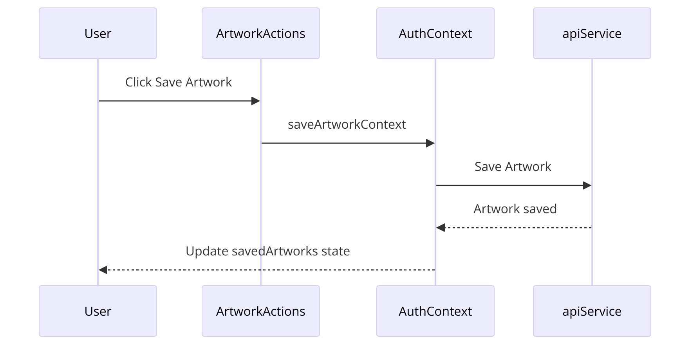

---

### Data Flow

#### Component: `AuthContext`
**Purpose:** 
`AuthContext` is used for global state management. It tracks user information and provides methods for login, logout, and managing collections and saved artworks.

**Details:**
- **State Management:** Manages `user`, `savedArtworks`, and `collections`.
- **Login/Logout:** The `login` method stores user data in local storage and updates the user state. The `logout` method clears local storage and resets the user state.
- **Data Fetching:** On user login, it fetches saved artworks and collections from the backend and updates the state accordingly.

#### Component: `Map_visual`
**Purpose:**
Renders the map and highlights galleries based on user collections or saved artworks.

**Details:**
- **Rendering:** Fetches and renders the SVG map.
- **State Update:** Updates highlighted galleries based on user data.
- **Interactions:** Allows users to click on galleries to see more details.

**Example Data Flow:**

**Fetching Galleries:**
- **Component:** `Map_visual`
- **Action:** User logs in, triggering the fetch for highlighted galleries.
- **Flow:** `getHighlightedGalleries` -> Updates `highlightedGalleries` state.

#### Component: `ArtworkList`
**Purpose:**
Displays a list of artworks from a selected gallery.

**Details:**
- **Rendering:** Fetches artworks by gallery number.
- **State Update:** Updates artwork list and visibility based on API responses.
- **Interactions:** Allows users to view artwork details and manage artwork status.

**Example Data Flow:**

**Fetching Artworks:**
- **Component:** `ArtworkList`
- **Action:** User selects a gallery.
- **Flow:** `getArtworksByGalleryNumber` -> Filters and sets `artworks` state.

#### Component: `ArtworkActions`
**Purpose:**
Handles actions related to artworks, such as saving or removing an artwork from the user's saved list.

**Details:**
- **Rendering:** Includes buttons like "Save", "Remove", "Add to Collection", and "View Details".
- **API Calls:** Uses functions from `apiService` to interact with the backend.
- **State Update:** Calls context methods (`saveArtworkContext`, `removeArtworkContext`) to update the global state and local storage.

**Example Data Flow:**

**Saving Artwork:**
- **Button:** A "Save" button is rendered in `ArtworkActions`.
- **API Call:** On button click, the `saveArtworkContext` function from `AuthContext` is called.
- **State Update:** `saveArtworkContext` sends a POST request to save the artwork via `apiService`, updates the `savedArtworks` state, and persists changes to local storage.

#### Component: `ManageCollections`
**Purpose:**
Manages creating new collections and adding artworks to collections.

**Details:**
- **Rendering:** Displays UI for creating collections and adding artworks.
- **API Calls:** Uses functions from `apiService` to create collections and add artworks.
- **State Update:** Updates global state through context methods and ensures collections are reflected in local storage.

**Example Data Flow:**

**Creating and Adding to Collection:**
- **Form:** User inputs collection name in a form rendered in `ManageCollections`.
- **API Call:** On form submission, calls an API to create the collection.
- **State Update:** Uses `AuthContext` to update the `collections` state and add the new collection. Another API call adds artwork to the newly created collection, and the state is updated accordingly.

#### Component: `CollectionsPage`
**Purpose:**
Displays and manages user collections and saved artworks.

**Details:**
- **Rendering:** Displays collections and allows navigation to specific collections.
- **API Calls:** Uses functions from `apiService` to fetch and delete collections.
- **State Update:** Updates collections and artwork lists based on user interactions.

**Example Data Flow:**

**Managing Collections:**
- **Button:** A "Delete" button is rendered in `CollectionsPage`.
- **API Call:** On button click, calls `deleteCollection` from `apiService`.
- **State Update:** Updates `collections` state and removes the deleted collection.

#### Component: `Discover`
**Purpose:**
Handles the scavenger hunt feature and allows users to save found artworks as a collection.

**Details:**
- **Rendering:** Displays a list of artworks for the scavenger hunt.
- **API Calls:** Fetches scavenger hunt data and verifies user guesses.
- **State Update:** Updates artwork states based on user interactions and API responses.

**Example Data Flow:**

**Generating Scavenger Hunt:**
- **Button:** A "Generate Scavenger Hunt" button is rendered in `Discover`.
- **API Call:** On button click, calls `fetchScavengerHunt` from `apiService`.
- **State Update:** Updates `artworks` state with fetched data and persists it in local storage.

### Reusable Buttons
To make the buttons (Save, Remove, Add to Collection, and View Details) reusable across the site, they are organized in:
- **Artwork Specific:** `ArtworkActions`
- **Collection Specific:** `ManageCollections`

